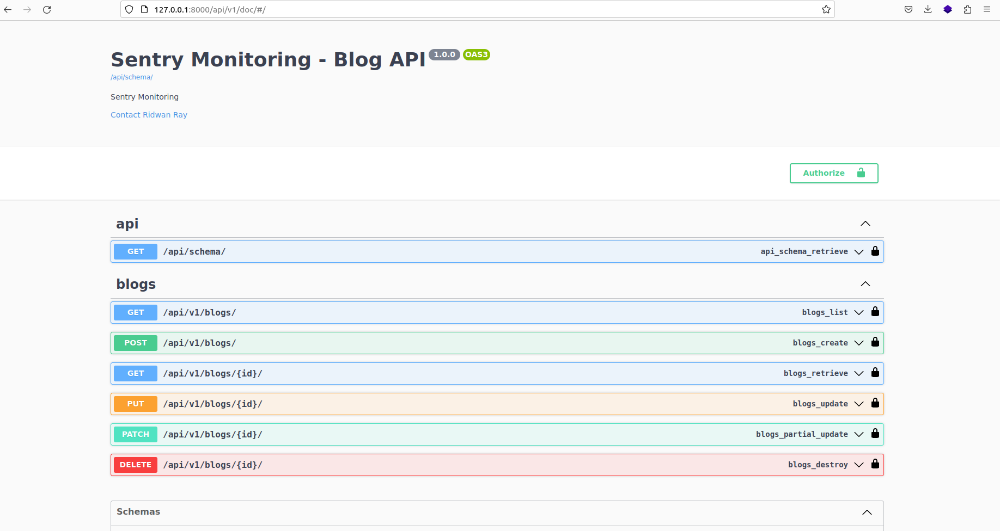

# Django and Senty setup
<p>
  <a href="https://twitter.com/talkcoding" target="_blank">
    
  </a>
</p>

👋 Your software applications need monitoring. <br>
This codebase showcase how to use Sentry with Django for monitoring
This article has complete guide:  [check here](https://medium.com/@elijahobara/integrate-sentry-in-django-project-monitoring-a-django-project-4ee008cb2816)
# Setup & running locally

Create a .env file by copying the .env.sample provided and run:
```
docker compose build && docker compose up
```
to start the container. As an alternative, run:
```
docker compose -f docker-compose.dev.yml up --build
```
to build and run the container using the dev yaml file.
Make sure to externalize the db instance to be used. It can be in another container.

## Run tests
Run descriptive tests in the container using:
```
docker exec -it -w /app <container_name> pytest -rP -vv
```
Access the docs on:

```
http://localhost:10060/api/v1/doc
```
## Running In a Virtual Env

Create a virtual environment using:
```
mkvirtualenv <env_name>
```

Ensure you have installed `virtualenv` on your system and install dev dependencies using
```
pip install -r requirements/dev.txt
```

Run migrations using:
```
python manage.py makemigrations

python manage.py migrate
```

Run the server using:
```
python manage.py runserver
```
 <br><br>
 <br><br>
 <br><br>
